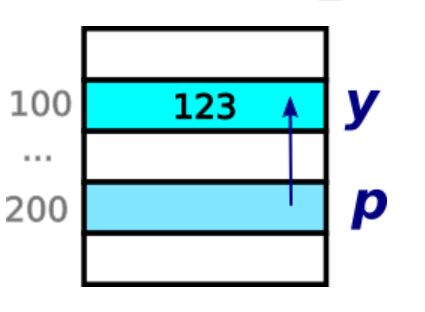

# 4.7 Адреса и указатели. Тесты

* **Тест 1**  
**y**  
`int y = 123;`  
`int * p = &y;`  
Допустим, что переменная `y` лежит по адресу 100, а переменная `p` лежит по адресу 200.  
  
Чему равно значение переменной `y`?  
  * Ответ: 123

* **Тест 2**  
**p**  
`int y = 123;`  
`int * p = &y;`  
Допустим, что переменная `y` лежит по адресу 100, а переменная `p` лежит по адресу 200.  
  
Чему равно значение переменной `p`?  
  * Ответ: 100  

* **Тест 3**  
**&y**  
`int y = 123;`  
`int * p = &y;`  
Допустим, что переменная `y` лежит по адресу 100, а переменная `p` лежит по адресу 200.  
  
Чему равно значение выражения `&y`?  
  * Ответ: 100  

* **Тест 4**  
**\*p**  
`int y = 123;`  
`int * p = &y;`  
Допустим, что переменная `y` лежит по адресу 100, а переменная `p` лежит по адресу 200.  
  
Чему равно значение выражения `*p`?  
  * Ответ: 123  

* **Тест 5**  
**&p**  
`int y = 123;`  
`int * p = &y;`  
Допустим, что переменная `y` лежит по адресу 100, а переменная `p` лежит по адресу 200.  
  
Чему равно значение выражения `&p`?  
  * Ответ: 200  

* **Тест 6**  
**Тип указателя**  
`int y = 123;`  
`??? p = &y;`  
Какого типа должна быть переменная p (что нужно написать вместо ???):  
  * (-) int
  * (+) int \*
  * (-) \* int
  * (-) int \&
  * (-) \& int

* **Тест 7**  
**Тип указателя**  
`int y = 123;`  
`??? p = &y;`  
Какого типа должна быть переменная p (что нужно написать вместо ???) **Пишите БЕЗ пробела!**:  
  * int*
