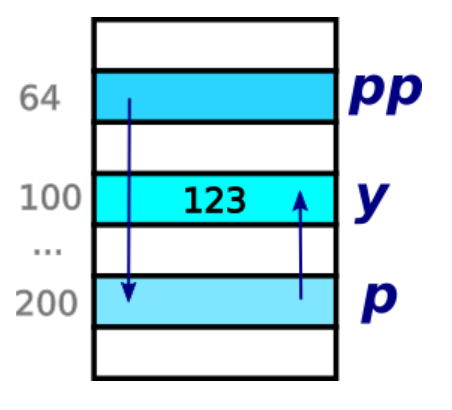

# 4.9 int **. Тесты 01 и 02

* **Тест 1. Какой тип имеет выражение?**  
`int y = 123;`  
`int * p = &y;`  
`int ** pp = &p;`  
Допустим, что переменная `y` лежит по адресу 100, переменная `p` по адресу 200, переменная `pp` по адресу 64.  
  
Отметьте верные ячейки  
`выражение    int    int *    int **`  
`y            +      -        -`  
`&y           -      +        -`  
`p            -      +        -`  
`*p           +      -        -`  
`&p           -      -        +`  
`pp           -      -        +`  
`*pp          -      +        -`  
`**pp         +      -        -`  

* **Тест 2. Чему равно значение выражения?**  
`int y = 123;`  
`int * p = &y;`  
`int ** pp = &p;`  
Допустим, что переменная `y` лежит по адресу 100, переменная `p` по адресу 200, переменная `pp` по адресу 64.  
  
Отметьте, чему равно значение выражения.  
`выражение    123    64    100    200    другое`  
`y            +      -     -      -      -`  
`p            -      -     +      -      -`  
`pp           -      -     -      +      -`  
`&p           -      -     -      +      -`  
`&pp          -      +     -      -      -`  
`*p           +      -     -      -      -`  
`*pp          -      -     +      -      -`  
`**pp         +      -     -      -      -`  
