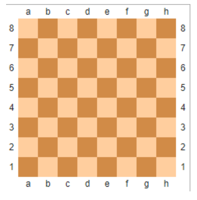
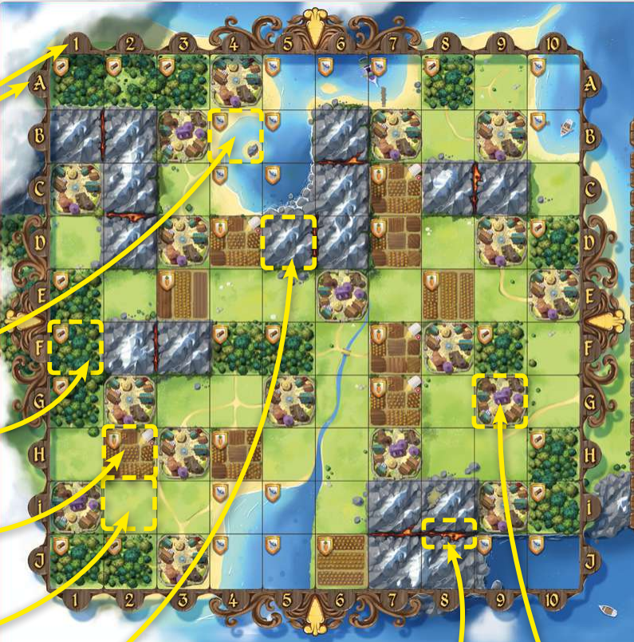

# 5.2 Символы. Tasks - Задания

## **Task 01. из большой в маленькую**

* Дана большая латинская буква. Напечатайте соответствующую ей маленькую латинскую букву.  
Посылать всю программу. Проверку входных данных делать не нужно, гарантируется, что первый символ входного потока - большая латинская буква.  
**Sample Input:**  
A  
**Sample Output:**  
a  

## **Task 02. следующая клетка**

  

* В записи шахматных партий клетки шахматной доски кодируются буквой и цифрой. Буква означает номер столбца, цифра - номер ряда.  
Напечатать, координаты клетки на один ряд выше.  
Будут даны клетки из рядов с 1 по 7.  
**Sample Input:**  
b3  
**Sample Output:**  
b4  

## **Task 03. королевство кроликов (без границ)**

* В игре Королевство кроликов доска 10х10 клеток. Ряды кодируются буквами ABCDEFGHIJ сверху вниз, столбцы кодируются числами от 1 до 10 слева направо.  
  
В игре нужно занимать клетки, соседние по горизонтали и вертикали.  
`|     1    2    3    4    5    6    7    9    1    0 |`  
`------------------------------------------------------`  
`| A                                                  |`  
`| B                                                  |`  
`| C                                                  |`  
`| D                  D4                              |`  
`| E             E3   E4   E5                         |`  
`| F                  F4                              |`  
`| G                                                  |`  
`| H                                                  |`  
`| I                                                  |`  
`| J                                                  |`  
`------------------------------------------------------`  
Дана координата клетки. Напечатайте верхнюю, правую, нижнюю и левую соседние клетки на одной строке через пробел.  
Гарантируется, что входные данные не содержат клеток на краю поля.  
**Sample Input:**  
E4  
**Sample Output:**  
D4 E5 F4 E3  
