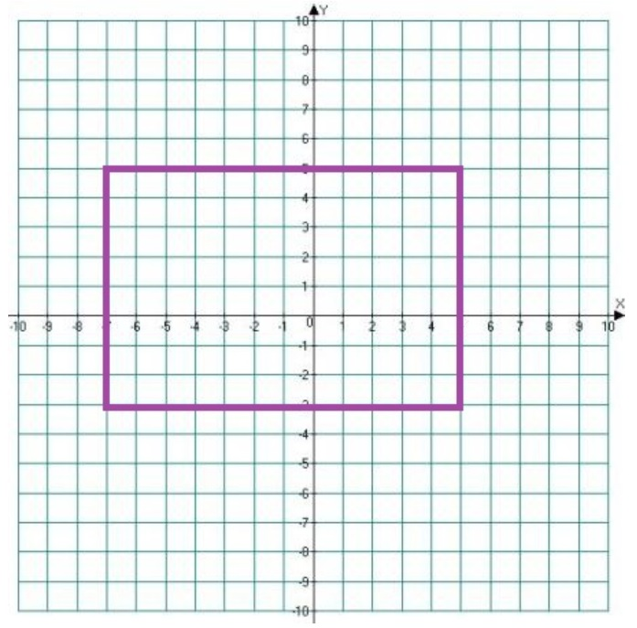

# 5.3 struct. Tasks - Задания

## **Task 01 time_def Определение структуры Time**

* Для хранения и представления показаний часов напишите структуру с именем Time и целочисленными полями h и m.  
Посылать только объявление структуры.  
Не забудьте про ;.  
Программа будет состоять из:  

``` // Листинг задания 1
// ваш код

// Этот код уже будет в проверяющей системе:
#include <stdio.h>

int main()
{
    struct Time t;
    scanf("%d:%d", &t.h, &t.m);
    printf("%02d:%02d\n", t.h, t.m);
    return 0;
}
```  

**Sample Input:**  
02:34  
**Sample Output:**  
02:34  

## **Task 02 rect_xywh Определить тип данных для хранения прямоугольника**

* Прямоугольник на плоскости XY со сторонами, параллельными осям, можно задать по-разному.  
  
**Точка и размеры**  
Объявите тип данных для описания прямоугольника, заданного x и y координатами левой верхней точки и его размерами.  
Имя структуры **Rect0**, поля **x, y, width** (ширина), **height** (высота) типа **int**.  
Объявите переменную **a** этого типа и проинициализируйте ее так, чтобы она описывала прямоугольник на рисунке.  
Отправлять только объявление структуры, декларацию переменной и ее инициализацию.  
**Sample Input:**  
Ничего не вводится  
**Sample Output:**  
-7 5 12 8  

## **Task 03 rect_ltrb Определить тип данных для хранения прямоугольника**

* Прямоугольник на плоскости XY со сторонами, параллельными осям, можно задать по-разному.  
  
**Точки по диагонали**  
В программе **уже объявлена** (не надо ее посылать!) структура для хранения `x` и `y` координат точек  

```//struct Point листинг
struct Point {
    int x;
    int y;
};
```  

Объявите тип данных для описания прямоугольника, заданного `x` и `y` координатами левой верхней точки и правой нижней точки.  
Имя структуры **Rect1**, поля **lt** (left top, левая верхняя точка) и **rb** (right bottom, правая нижняя точка) типа struct Point. Объявите переменную **b** этого типа и проинициализируйте ее так, чтобы она описывала прямоугольник на рисунке.  
Отправлять только объявление структуры, декларацию переменной и ее инициализацию.  

**Sample Input:**  
Ничего не вводится  
**Sample Output:**  
-7 5 5 -3  

