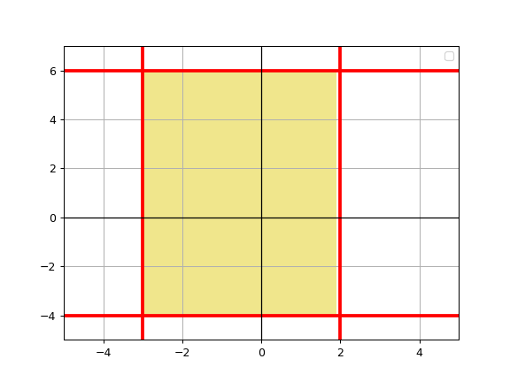
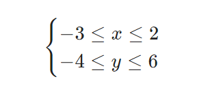

# 6.5 if - задачи для начинающих. Task 07

## **Task 07. if_rect Принадлежит ли точка области?**

По данным **x** и **y** координатам точки напечатайте - принадлежит точка к указанной области (включая границы) или нет.  

Если принадлежит, напечатайте `YES`, иначе напечатайте `NO`.  

  

Подсказка для тех, кто не особо силен в математике:  

 

**Sample Input:**  
\-2.3 3.7  
**Sample Output:**  
YES  
